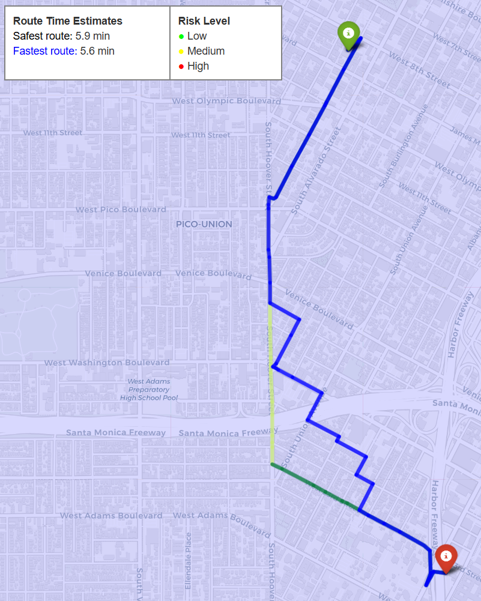

# GeospatialDataScienceProject
This repository is for our project in the Geospatial Data Science course at ITU, masters in Data Science.

Modern navigation systems primarily optimize routes based on distance and estimated travel time, often overlooking environmental safety factors such as accident likelihood and weather conditions. In this project, we have an application that integrates traffic accident data with weather information to assess and map road safety risk across Los Angeles. Using accident frequency and weather data, we compute risk scores for individual roads under different weather conditions. These risk maps are then incorporated into an A* routing algorithm to provide users with alternative paths that minimize exposure to high-risk roads, and compare the paths to the fastest route, calculated alongside it.

# Running our prototype routing:
First be in root directory, same as <pre> interactive_route.py </pre>

then run in commandline:
<pre> streamlit run interactive_route.py </pre>

Will open a browser window running a local server.
The loading of LA roads graph may take some time on the first load (2-5 minutes, depending on computer processing power). After that it should only take a second to calculate the routes.

To create a route, click anywhere within the marked LA area as origin spot, then another within as destination and it will calculate the fastest route (blue) and the route with minimal risk (green, can be orange and red segments if they are more risky).

# In case you cant run the prototype locally:
If you for some reason cant run the prototype locally here is a video demonstrating how it works.

# Recreating report like images
To recreate images like below:

Use the notebook called "route_testing.ipynb" and use the function "VisualizeMap()" from the custom library routing_utils.py imported as "ru", it is the same backend functions used for the interactive application mentioned above, just for a static image with more info on legends.

